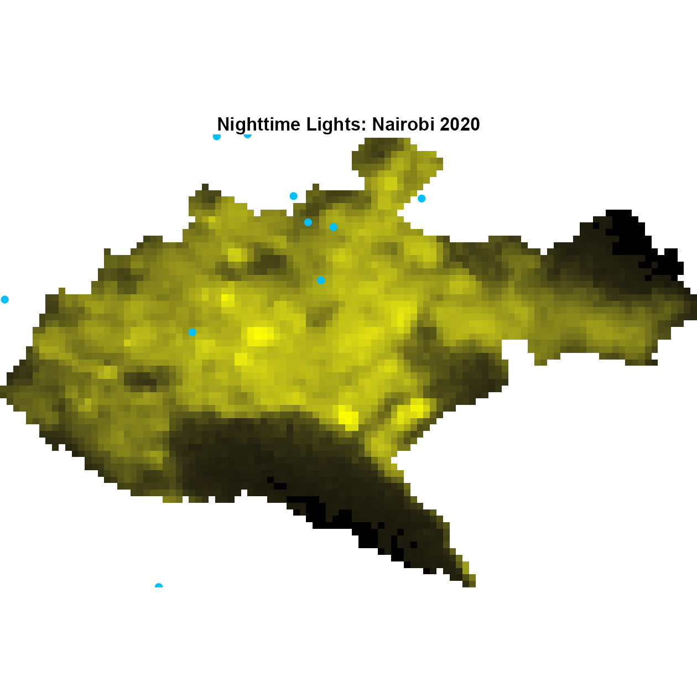
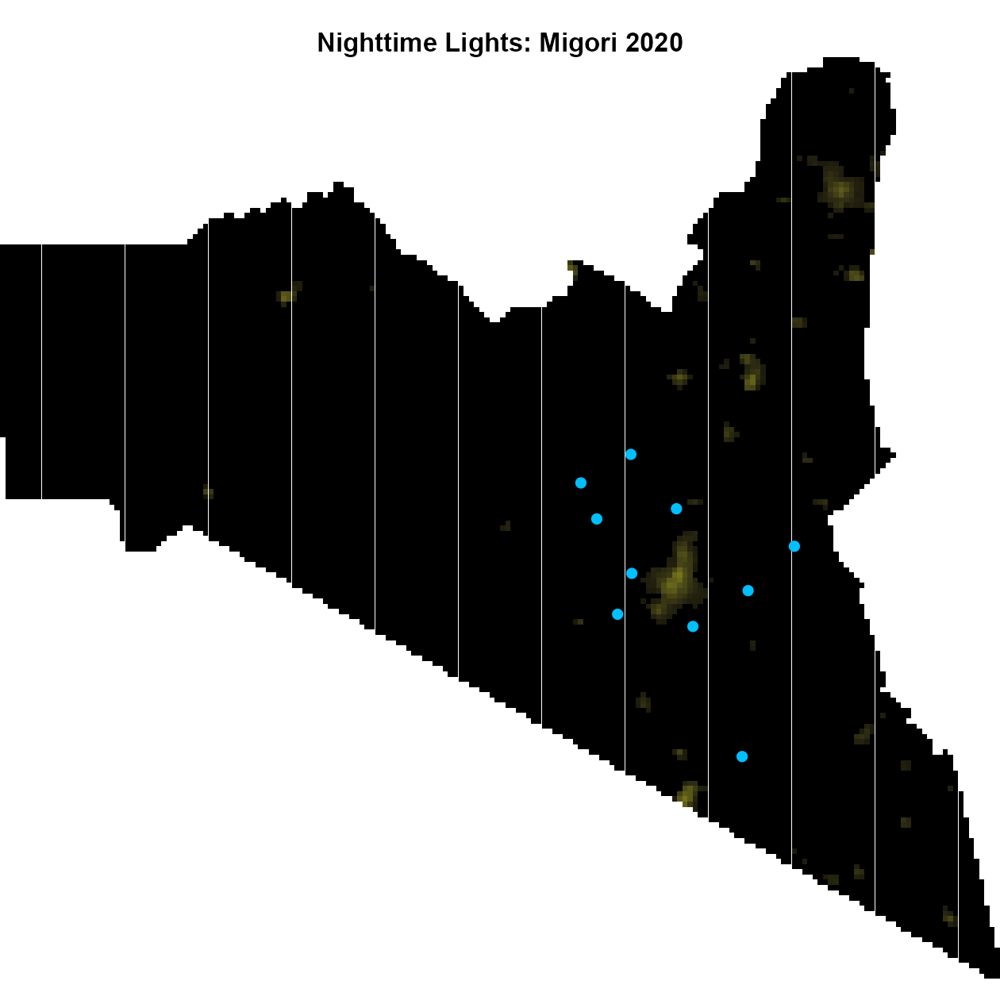

# Overview

This project demonstrates how to create a `degree_urban` variable from GPS
coordinates using NASA Black Marble nighttime lights data.

The intended users are working in RStudio. They only need to edit one script:

```text
R/process_blackmarble_urbanicity.R
```

That script points to the input data, chooses the output path, and defines the
longitude/latitude column names. The reusable download and extraction logic is
kept in `R/blackmarble_urbanicity_functions.R` and should not need editing for
ordinary data sets.

# Required Input

The processing script expects one row per GPS point with these columns by default:

```text
record_id, site, Longitude, Latitude, adm_date
```

If the coordinate columns are named differently, edit this line in
`R/process_blackmarble_urbanicity.R`:

```r
gps_cols <- c("Longitude", "Latitude")
```

For example:

```r
gps_cols <- c("lon", "lat")
```

The first value must be longitude and the second must be latitude.

Column meanings:


```
#>      column
#> 1 record_id
#> 2      site
#> 3 Longitude
#> 4  Latitude
#> 5  adm_date
#>                                                                           meaning
#> 1                                   Unique row or participant/location identifier
#> 2                             Site or study location name used to group downloads
#> 3                                             Longitude in decimal degrees, WGS84
#> 4                                              Latitude in decimal degrees, WGS84
#> 5 Admission or observation date; the year selects the Black Marble annual product
```

# What Users Need Before Running

## 1. NASA Earthdata / LAADS token

Black Marble H5 files are downloaded from NASA LAADS DAAC. Users need a NASA
Earthdata account and a LAADS bearer token.

Follow the token instructions in the BlackMarbleR documentation:

<https://worldbank.github.io/blackmarbler/#bearer-token>

In short:

1. Create or sign in to a NASA Earthdata account.
2. Fill in the required profile fields such as study area, user type, and
   organization.
3. Accept the required EULAs.
4. Authorize LAADS access if prompted.
5. Go to Earthdata Login and use **Generate Token** / **Show Token** to copy the
   bearer token.

If the token stops working later, generate a new token and update `.Renviron`.

## 2. Save the token in `.Renviron`

In RStudio, run this once in the Console:


``` r
install.packages("usethis")
usethis::edit_r_environ()
```

This opens the `.Renviron` file. Add one line:

```text
LAADS_DAAC="PASTE_YOUR_TOKEN_HERE"
```

Keep the quotes around the token, as shown above. Do not add `Bearer` inside the quotes.

Save the file, then restart RStudio:

```text
Session > Restart R
```

After restart, users can check that R sees the token:


``` r
Sys.getenv("LAADS_DAAC")
```

This should print a long token string. If it prints `""`, `.Renviron` was not
saved in the right place or RStudio was not restarted.

# The One Script To Edit

Open this file in RStudio:

```text
R/process_blackmarble_urbanicity.R
```

For a real data set, users usually only edit these lines near the top:

```r
input_file <- file.path("data", "my_real_gps_data.csv")
output_file <- file.path("data", "processed", "my_real_gps_data_urbanicity.csv")
gps_cols <- c("Longitude", "Latitude")
```

If the real data uses different coordinate names:

```r
gps_cols <- c("lon", "lat")
```

Then click **Source** in RStudio to run `R/process_blackmarble_urbanicity.R`.

# Teaching Data

For teaching or testing, open and source this script first:

```text
R/simulate_chain_gps_data.R
```

It creates:

```text
data/simulated_chain_gps_data.csv
```

Then source:

```text
R/process_blackmarble_urbanicity.R
```

The processing step writes:

```text
data/processed/simulated_chain_gps_data_urbanicity.csv
data/metadata/blackmarble_download_log.csv
```

# Example Output: Kenya Counties

After running `R/process_blackmarble_urbanicity.R`, users should be able to see
both the extracted values and the raster context they came from. This example
uses simulated patient points from Nairobi and Migori with the Kenya county
shapefile copied into `data/raw/boundaries/kenya_counties/`.

The two figures below use the 2020 annual Black Marble layer as display maps for
an urban/rural contrast: Nairobi first, then Migori. Patient locations are plain
blue dots. The dots only represent patient locations; no patient variables are
mapped to color, size, or shape. Each raster is clipped to its county boundary
and log-scaled for display only. The extracted `degree_urban` values below still
come from each record's own admission year.

<div class="figure">

<p class="caption">Nairobi patient locations over 2020 Black Marble nighttime lights.</p>
</div>

<div class="figure">

<p class="caption">Migori patient locations over 2020 Black Marble nighttime lights.</p>
</div>

The top five records by extracted `degree_urban` for each example county are:


```
#>        site record_id   adm_date Longitude  Latitude degree_urban
#>      <char>    <char>     <IDat>     <num>     <num>        <num>
#>  1:  Migori  01migori 2018-07-31  34.52287 -1.209792     0.000000
#>  2:  Migori  02migori 2017-07-01  34.52766 -1.077063     0.000000
#>  3:  Migori  03migori 2020-04-29  34.43460 -1.063267     0.000000
#>  4:  Migori  04migori 2018-08-06  34.47032 -1.011561     0.000000
#>  5:  Migori  05migori 2020-07-04  34.42326 -1.095961     0.000000
#>  6: Nairobi 07nairobi 2016-03-19  36.86370 -1.249444    26.127733
#>  7: Nairobi 02nairobi 2017-11-28  36.78137 -1.282645    21.630608
#>  8: Nairobi 06nairobi 2019-01-24  36.92807 -1.197098    19.033770
#>  9: Nairobi 05nairobi 2017-09-22  36.87160 -1.215318    17.300299
#> 10: Nairobi 03nairobi 2020-02-26  36.66139 -1.261743     9.548058
```

To recreate the figure, open and source this script in RStudio:

```text
R/plot_readme_kenya_county_examples.R
```

# Optional Map Check

The code from the BlackMarbleR documentation is useful for making a map. In this
project, the equivalent optional QA script is:

```text
R/plot_blackmarble_site_map.R
```

Run `R/process_blackmarble_urbanicity.R` first, then open
`R/plot_blackmarble_site_map.R` in RStudio and edit these lines if needed:

```r
site_name <- "Banfora"
target_year <- 2016
gps_cols <- c("Longitude", "Latitude")
```

Then click **Source**. The script uses the downloaded H5 files listed in
`data/metadata/blackmarble_download_log.csv`, log-scales the raster for display,
and writes a PNG map to `data/processed/`.

This map is only for visual checking. The main output variable is still created
by R/process_blackmarble_urbanicity.R.

# Project Layout

```text
R/
  simulate_chain_gps_data.R
  blackmarble_urbanicity_functions.R
  process_blackmarble_urbanicity.R
  plot_blackmarble_site_map.R
  plot_readme_kilifi_example.R
  plot_readme_kenya_county_examples.R

data/
  simulated_chain_gps_data.csv
  raw/
    blackmarble_h5/
      VNP46A4.A2016001.h17v07.002.2025101113454.h5
    boundaries/
      kenya_counties/
        County.shp
  processed/
    simulated_chain_gps_data_urbanicity.csv
    nairobi_blackmarble_patients.png
    migori_blackmarble_patients.png
  metadata/
    blackmarble_download_log.csv
```

The `.h5` files keep their original NASA filenames. Those filenames identify
the product, date, tile, and version. Site-specific usage is tracked separately
in `data/metadata/blackmarble_download_log.csv`.

# Install Packages

Install the required R packages if needed:


``` r
install.packages(c(
  "data.table",
  "sf",
  "terra",
  "httr2",
  "readr",
  "knitr",
  "rmarkdown",
  "usethis",
  "ggplot2",
  "tidyterra"
))
```

# Quick Checks

These chunks inspect local files only; they do not contact NASA.


``` r
expected_paths <- c(
  "R/simulate_chain_gps_data.R",
  "R/blackmarble_urbanicity_functions.R",
  "R/process_blackmarble_urbanicity.R",
  "R/plot_readme_kenya_county_examples.R",
  "data/simulated_chain_gps_data.csv",
  "data/raw/blackmarble_h5",
  "data/raw/boundaries/kenya_counties/County.shp",
  "data/processed",
  "data/metadata/blackmarble_download_log.csv"
)

data.frame(
  path = expected_paths,
  exists = file.exists(expected_paths)
)
#>                                            path exists
#> 1                   R/simulate_chain_gps_data.R   TRUE
#> 2          R/blackmarble_urbanicity_functions.R   TRUE
#> 3            R/process_blackmarble_urbanicity.R   TRUE
#> 4         R/plot_readme_kenya_county_examples.R   TRUE
#> 5             data/simulated_chain_gps_data.csv   TRUE
#> 6                       data/raw/blackmarble_h5   TRUE
#> 7 data/raw/boundaries/kenya_counties/County.shp   TRUE
#> 8                                data/processed   TRUE
#> 9    data/metadata/blackmarble_download_log.csv   TRUE
```


``` r
input_file <- file.path("data", "simulated_chain_gps_data.csv")

if (file.exists(input_file)) {
  data.table::fread(input_file, nrows = 6)
}
#>    record_id   site country Longitude  Latitude   adm_date
#>       <char> <char>  <char>     <num>     <num>     <IDat>
#> 1:  01kilifi Kilifi   Kenya  39.79990 -3.555220 2017-09-25
#> 2:  02kilifi Kilifi   Kenya  39.71551 -3.619576 2017-02-09
#> 3:  03kilifi Kilifi   Kenya  39.93116 -3.598053 2016-12-31
#> 4:  04kilifi Kilifi   Kenya  39.83651 -3.511625 2018-05-01
#> 5:  05kilifi Kilifi   Kenya  39.84648 -3.646544 2017-02-15
#> 6:  06kilifi Kilifi   Kenya  39.96702 -3.568427 2020-10-04
```


# Notes

The raw Black Marble H5 cache may be large. It is kept under
`data/raw/blackmarble_h5` so downloaded tiles can be reused across sites and
runs without duplicating the same NASA tile under multiple site-specific names.
This folder is excluded by `.gitignore` because some NASA H5 files can exceed
GitHub's file-size limits.
